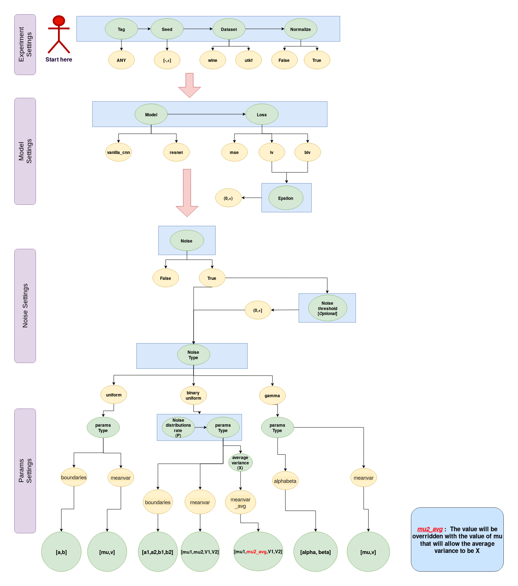

# Inverse Variance Weighting for Heteroscedastic Noisy Labels in Deep Learning

## Introduction

One of the fundamental  assumptions  in  super-vised deep learning is that the labels are correct. However, this assumption does not hold in many cases.  Error (noise) on the labels can severely impact the ability of the model to learn. In many cases, the noise on the labels is heteroscedastic and the variable variance is either known, or can be readily estimated from analysis on the dataset. In this work, we propose to leverage the known label variance as a tool to improve learning. Intuitively, we use an information theoretic approach and weight training samples by the inverse variance in the training loss function. We also show that weight normalization by mini-batch (rather than at the level of the entire dataset) improves stability in the learning process. 

### Prerequisites

To run the code, we wrapped up all the used libraries inside a singularity container, you can download it [here](https://drive.google.com/file/d/1I17AjFeC7GULokpb1_NkBdbXqX2LHT66/view?usp=sharing). To manually build your environment using anaconda, we provide the yml file [here](https://github.com/montrealrobotics/Adaptable-RL-via-IV-update/blob/master/env.yml). 

### Run the Code

To run the code locally:

```bash
python main.py --experiment_settings="exp_tag,7159,utkf,True" --model_settings="mse,resnet" --noise="False" --noise_settings="gamma,-1"  --average_variance="-1"  --params_settings="manvar,-1"  --parameters="10,5,200,200" --epsilon="0.5" --distributions_ratio="0.3"
```

To run the code locally inside singularity container:

```bash
singularity exec --nv -H $HOME:/home/ -B ./your_dataset_directory:/datasets/ -B ./your_outputs_directory:/final_outps/  ./your_environments_directory/pytorch_f.simg python /path/to/main.py  --experiment_settings="exp_tag,7159,utkf,True" --model_settings="mse,resnet" --noise="False" --noise_settings="gamma,-1"  --average_variance="-1"  --params_settings="manvar,-1"  --parameters="10,5,200,200" --epsilon="0.5" --distributions_ratio="0.3"
```


To run the code in a cluster that supporting [slurm workload manager](https://slurm.schedmd.com/), use this starter script:

```bash
#!/bin/bash
#SBATCH -o /path/to/logs/noise_%j.out   # Change this!
#SBATCH --cpus-per-task=4  
#SBATCH --gres=gpu:1        
#SBATCH --mem=32Gb    

# Load cuda (it is not needed if have it enabled as a default.)
module load cuda/10.0    
# 1. You have to load singularity (it is not needed if have it enabled as a default.)
module load singularity   
# 2. Then you copy the container to the local disk
rsync -avz /path/to/pytorch_f.simg $SLURM_TMPDIR     # Change this!
# 3. Copy your dataset on the compute node
rsync -avz /path/to/your_dataset/ $SLURM_TMPDIR        # Change this!
# 3.1 export wandb api key
export WANDB_API_KEY="put your wandb key here"       # Change this!
# 4. Executing your code with singularity
singularity exec --nv -H $HOME:/home/ -B $SLURM_TMPDIR:/datasets/ -B $SLURM_TMPDIR:/final_outps/  $SLURM_TMPDIR/pytorch_f.simg python /path/to/main.py --experiment_settings=$1 --model_settings=$2 --noise=$3 --noise_settings=$4  --average_variance=$5  --params_settings=$5  --parameters=$6 --epsilon=$7 --distributions_ratio=$8
# 5. Move results back to the login node.
rsync -avz $SLURM_TMPDIR --exclude="your_dataset" --exclude="pytorch_f.simg"  /path/to/outputs  # Change this!

# Note:
# $SLURM_TMPDIR = The compute node directory.
```

then run the script with ```sbatch```:

```bash
sbatch --gres=gpu:rtx8000:1 ./path/to/main.sh "exp_tag,7159,utkf,True" "mse,resnet" "False" "gamma,-1" "-1" "manvar,-1" "10,5"
```


## Examples

- To run a vanilla CNN while normalising the data, where the loss function is MSE:

  ```bash
  python main.py --experiment_settings="exp_tag,7159,utkf,True" --model_settings="mse,vanilla_cnn"
  ```

- To run resnet-18 with BIV loss (epsilon=0.5), where the noise variance is coming from a single uniform distribution:

  ```bash
  python main.py --experiment_settings="exp_tag,7159,utkf,True" --model_settings="biv,resnet" --noise="True" --noise_settings="uniform,-1"  --average_variance="-1"  --params_settings="boundaries,-1"  --parameters="0,1" --epsilon="0.5" --distributions_ratio="1"
  ```

- To run resnet-18 with BIV loss (epsilon=0.5), where the noise variance is coming from a bi-model (uniform) distribution:

  ```bash
  python main.py --experiment_settings="exp_tag,7159,utkf,True" --model_settings="biv,resnet" --noise="True" --noise_settings="uniform,-1"  --average_variance="2000"  --params_settings="boundaries,-1"  --parameters="0,1,20,10" --epsilon="0.5" --distributions_ratio="0.5"
  ```
  
- To run resnet-18 with MSE loss, where the noise variance is coming from a bi-model (uniform) distribution by specifying the mean and variance of this model:

  ```bash
  python main.py --experiment_settings="exp_tag,7159,utkf,True" --model_settings="mse,resnet" --noise="True" --noise_settings="uniform,-1"  --average_variance="2000"  --params_settings="meanvar,-1"  --parameters="0,1,20,10" --distributions_ratio="0.5"
  ```
  
- To run resnet-18 with BIV loss (epsilon=0.5), where the noise variance is coming from a bi-model (uniform) distribution by specifying the mean and variance of this model:

  ```bash
  python main.py --experiment_settings="exp_tag,7159,utkf,True" --model_settings="biv,resnet" --noise="True" --noise_settings="uniform,-1"  --average_variance="2000"  --params_settings="meanvar,-1"  --parameters="0,1,20,10" --epsilon="0.5" --distributions_ratio="0.5"
  ```
  
-  To run resnet-18 with BIV loss (epsilon=0.5), where the noise variance is coming from a bi-model (uniform) distribution and with noise threshold=1:

  ```bash
  python main.py --experiment_settings="exp_tag,7159,utkf,True" --model_settings="biv,resnet" --noise="True" --noise_settings="uniform,1"  --average_variance="2000"  --params_settings="meanvar,-1" --parameters="0,1,20,10" --epsilon="0.5" --distributions_ratio="0.5"
  ```

## Command-line Arguments

### 1] Flow Chart



### 2] Table:

| Group                                                  | Argument                                           | Description                                                  | Value                                                        | Data Type |
| ------------------------------------------------------ | :------------------------------------------------- | :----------------------------------------------------------- | :----------------------------------------------------------- | :-------: |
|                                                        | **Tag**                                            | Experiment wandb tag. [(click here for more details)](https://docs.wandb.com/app/features/tags) | Any                                                          |  string   |
|                                                        | **Seed**                                           | Experiment seed.                                             | Any                                                          |   float   |
| <span style="color:red">**experiment_settings**</span> | **Dataset**                                        | The available datasets:<br/>1-UTKFace. ([click here for more details](https://susanqq.github.io/UTKFace/)) <br />2-Wine Quality. ([click here for more details](https://archive.ics.uci.edu/ml/datasets/wine+quality)) | 1- utkf<br />2- wine                                         |  string   |
|                                                        | **Normalization**                                  | Enable dataset normalization                                 | True or False                                                |  boolean  |
|                                                        | <br /><br /><br /><br />                           |                                                              |                                                              |           |
|                                                        | **Model type**                                     | The available models:<br />1- Vanilla ANN, ([click here for more details](https://github.com/montrealrobotics/Adaptable-RL-via-IV-update/blob/master/model.py))<br /> 2-Vanilla CNN. ([click here for more details](https://github.com/montrealrobotics/Adaptable-RL-via-IV-update/blob/master/model.py))<br />3- Resnet-18. ([click here for more details](https://pytorch.org/hub/pytorch_vision_resnet/))<br /> | 1-vanilla_ann<br />2- vanilla_cnn<br />3- resnet             |  string   |
| <span style="color:red">**model_settings**</span>      | **Loss type**                                      | The available loss functions:<br />1- Mean squared error. (MSE)<br />2- Inverse variance. (IV)<br />3- Batch inverse varaince. (BIV) | 1- mse<br />2- iv<br />3- biv                                |  string   |
|                                                        | **Epsilon**                                        | A parameter that prevents the BIV function from having high loss values. | [0-1)                                                        |   float   |
|                                                        | <br /><br /><br /><br />                           |                                                              |                                                              |           |
|                                                        | **Noise**                                          | Enabling noise addition to the labels                        | True or False                                                |  boolean  |
| <span style="color:red">**noise_settings**</span>      | **Noise type**                                     | The available noise variance distributions:<br />1- Uniform distribution.<br />2- Gamma distribution. | 1- uniform<br />2- gamma                                     |  string   |
|                                                        | **Threshold value**                                | Noise threshold cutoff value.                                | [0,+]<br />< 0, disable |   float   |
|                                                        | <br /><br /><br /><br />                           |                                                              |                                                              |           |
|                                                        | **Params Type**                                    | The current baseline supports the following settings for the noise distributions:<br />1- Uniform boundaries: Where the boundaries of the uniform are provided.<br />2- Gamma's parameters: Where alpha and beta are provided.<br />3- Mean and Variance: Where the mean  and variance (v) of the selected distribution should be provided to estimate the its  parameters indirectly. | 1- boundaries<br />2-alphabeta<br />3-meanvar                |  string   |
| <span style="color:red">**parmas_settings**</span>     | **Heteroscedasticty Scale**                        | Scale the maximum heteroscedasticty value with an scalar.    | [0-1]<br />< 0 , disable                                     |   float   |
|                                                        | **Average Variance**<br />                 **(X)** | Average over means of the noise variance distributions (two):<br />X = p x + (1-p) x <br /><br />X = average mean variance.<br />p =  probability function over noise variance distributions.<br />= mean of the first distribution.<br /> = mean of the second distribution. | Any                                                          |   float   |
|                                                        | **Noise Distributions Ratio (p)**                  | Probability function over noise variance distributions. This is to study the contribution effect of low and high noise variance distributions. | [0-1]                                                        |   float   |
|                                                        | <br /><br /><br /><br />                           |                                                              |                                                              |           |
| <span style="color:red">**parameters**</span>          | **Parameters**                                     | Parameters of the noise variance distributions:<br />1- Uniform (a,b)<br />2- Gamma ( and )<br />**Or:**<br /> and v of the noise variance distributions.<br /><br />Note: The number of distributions is not limited, you can pass whatever number you want.<br /> | 1- Uniform: <br />(, , ..., ,, ...)<br />2- Gamma:<br /> (, ,..., , , ...)<br /><br />**Or:**<br />,, ..., , , ... |   list    |

## Contributors

* **Waleed Khamies**
* **Vincent Mai**

## License

This project is licensed under the [???] License - see the [LICENSE.md](LICENSE.md) file for details

## Acknowledgement

* [Liam Paull](https://liampaull.ca/) - Principle Investigator - [Robotics Lab (UdeM University)](https://montrealrobotics.ca/)
* [National Sciences and Engineering Research Council of Canada](https://www.nserc-crsng.gc.ca/) 

