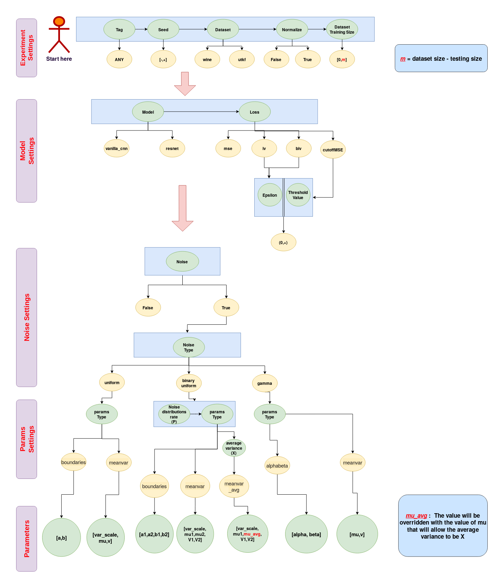

# Batch Inverse-Variance Weighting:  Deep Heteroscedastic Regression
ICML 2021 Workshop: Uncertainty in Deep Learning.

Paper available here: https://arxiv.org/abs/2107.04497

## Introduction

The performance of deep supervised learning methods is impacted when the training dataset, on which the parameters are optimized, and the testing dataset, which evaluates the performance of the model on the task, are not sampled from identical distributions. In heteroscedastic regression, the label for each training sample is corrupted by noise coming from a different distribution.  In some cases, it is possible to know an estimate of the variance of the noise for each label, which quantifies how much it contributes to the misalignment between the datasets. We propose an approach to include this privileged information in the loss function together with dataset statistics inferred from the mini-batch to mitigate the impact of the dataset misalignment. We adapt the idea of Fisher-information weighted average to function approximation and propose Batch Inverse-Variance weighting. We show the validity of this approach as it achieves a significant improvement of the performances of the network when confronted to high, input-independent noise. 

This code 

### Prerequisites

To run the code, we wrapped up all the used libraries inside a singularity container, you can download it [here](https://drive.google.com/file/d/1I17AjFeC7GULokpb1_NkBdbXqX2LHT66/view?usp=sharing). To manually build your environment using anaconda, we provide the yml file [here](https://github.com/montrealrobotics/Adaptable-RL-via-IV-update/blob/master/env.yml). 

### Run the Code

To run the code locally:

```bash
python main.py --experiment_settings="exp_tag,7159,utkf,True,16000" --model_settings="vanilla_cnn,cutoffMSE"
--noise_settings="True,binary_uniform" --params_settings="meanvar_avg,0.5,3000" --parameters="True,0.5,1,0.3,0"
```

To run the code locally inside singularity container:

```bash
singularity exec --nv -H $HOME:/home/ -B ./your_dataset_directory:/datasets/ -B ./your_outputs_directory:/final_outps/ ./your_environments_directory/pytorch_f.simg python /path/to/main.py  --experiment_settings="exp_tag,7159,utkf,True,16000" 
--model_settings="vanilla_cnn,cutoffMSE" --noise_settings="True,binary_uniform" --params_settings="meanvar_avg,0.5,3000"
--parameters="True,0.5,1,0.3,0"
```

To run the code in a cluster that supporting [slurm workload manager](https://slurm.schedmd.com/), use this starter script:

```bash
#!/bin/bash
#SBATCH -o /path/to/logs/noise_%j.out   # Change this!
#SBATCH --cpus-per-task=4  
#SBATCH --gres=gpu:1        
#SBATCH --mem=32Gb    

# Load cuda (it is not needed if have it enabled as a default.)
module load cuda/10.0    
# 1. You have to load singularity (it is not needed if have it enabled as a default.)
module load singularity   
# 2. Then you copy the container to the local disk
rsync -avz /path/to/pytorch_f.simg $SLURM_TMPDIR     # Change this!
# 3. Copy your dataset on the compute node
rsync -avz /path/to/your_dataset/ $SLURM_TMPDIR        # Change this!
# 4. Executing your code with singularity
singularity exec --nv -H $HOME:/home/ -B $SLURM_TMPDIR:/datasets/ -B $SLURM_TMPDIR:/final_outps/  $SLURM_TMPDIR/pytorch_f.simg python /path/to/main.py --experiment_settings=$1 --model_settings=$2 --noise_settings=$3 --params_settings=${4-"None"}  --parameters=${5-"None"}
# 5. Move results back to the login node.
rsync -avz $SLURM_TMPDIR --exclude="your_dataset" --exclude="pytorch_f.simg"  /path/to/outputs  # Change this!

# Note:
# $SLURM_TMPDIR = The compute node directory.
```

then run the script with ```sbatch```:

```bash
sbatch --gres=gpu:rtx8000:1 ./path/to/main.sh  "exp_tag,7159,utkf,True,16000" "vanilla_cnn,cutoffMSE" "True,binary_uniform" "meanvar_avg,0.5,3000" "True,0.5,1,0.3,0"
```


## Examples

- To run a vanilla CNN while normalising the data, where the loss function is MSE:

  ```bash
  python main.py --experiment_settings="exp_tag,7159,utkf,True,16000" --model_settings="vanilla_cnn,mse,0.5" --noise_settings="False" 
  ```

- To run resnet-18 with BIV loss (epsilon=0.5), where the noise variance is coming from a single uniform distribution:

  ```bash
  python main.py --experiment_settings="exp_tag,7159,utkf,True,16000" --model_settings="resnet,biv,0.5" --noise_settings="True,uniform" 
  --params_settings="boundaries" --parameters="0,1"
  ```

- To run resnet-18 with BIV loss (epsilon=0.5), where the noise variance is coming from a single uniform distribution that has a variance equal to the maximum heteroscedasticity:

  ```bash
  python main.py --experiment_settings="exp_tag,7159,utkf,True,16000" --model_settings="resnet,biv,0.5" --noise_settings="True,uniform" 
  --params_settings="meanvar" --parameters="True,0.5,0.083"
  ```
  
- To run resnet-18 with BIV loss (epsilon=0.5), where the noise variance is coming from a bi-model (uniform) distribution, in which the weight of the contribution of the both distributions is equal (0.5):

  ```bash
  python main.py --experiment_settings="exp_tag,7159,utkf,True,16000" --model_settings="resnet,biv,0.5" 
  --noise_settings="True,binary_uniform"  --params_settings="boundaries,0.5" --parameters="0,1,1,4"
  ```
  
- To run resnet-18 with MSE loss, where the noise variance is coming from a bi-model (uniform) distribution by specifying the mean and variance of this model:

  ```bash
  python main.py --experiment_settings="exp_tag,7159,utkf,True,16000" --model_settings="resnet,mse" --noise_settings="True,binary_uniform"  --params_settings="meanvar,0.5" --parameters="False,0.5,1,0.083,0"
  ```
  
- To run resnet-18 with BIV loss (epsilon=0.5), where the noise variance is coming from a bi-model (uniform) distribution in which the average mean is 2000.

  ```bash
  python main.py --experiment_settings="exp_tag,7159,utkf,True,16000" --model_settings="resnet,biv,0.5" 
  --noise_settings="True,binary_uniform"  --params_settings="meanvar_avg,0.5,2000" --parameters="False,0.5,1,0.083,0"
  ```
  
-  To run resnet-18 with MSE loss, where the noise variance is coming from a bi-model (uniform) distribution and with noise threshold=1:

  ```bash
  python main.py --experiment_settings="exp_tag,7159,utkf,True,16000" --model_settings="resnet,cutoffMSE,1" --noise_settings="True,binary_uniform" --params_settings="meanvar_avg,0.5,2000" --parameters="False,0.5,1,0.08,0"
  ```


## Command-line Arguments

### 1] Flow Chart



### 2] Table:

| Group                                                  | Argument                                             | Description                                                  | Value                                                        | Data Type  |
| ------------------------------------------------------ | :--------------------------------------------------- | :----------------------------------------------------------- | :----------------------------------------------------------- | :--------: |
|                                                        | **Tag**                                              | Experiment wandb tag. [(click here for more details)](https://docs.wandb.com/app/features/tags) | Any                                                          |   string   |
|                                                        | **Seed**                                             | Experiment seed.                                             | Any                                                          | int, float |
| <span style="color:red">**experiment_settings**</span> | **Dataset**                                          | The available datasets:<br/>1-UTKFace. ([click here for more details](https://susanqq.github.io/UTKFace/)) <br />2-Wine Quality. ([click here for more details](https://archive.ics.uci.edu/ml/datasets/wine+quality)) | 1- utkf<br />2- wine                                         |   string   |
|                                                        | **Normalization**                                    | Enable dataset normalization                                 | True or False                                                |  boolean   |
|                                                        | **Dataset Training Size**                            | Size of the training dataset.                                | Between 0 and the difference between the size of the dataset and the size of the test set |    int     |
|                                                        | <br /><br /><br /><br />                             |                                                              |                                                              |            |
|                                                        | **Model Type**                                       | The available models:<br />1- Vanilla ANN, ([click here for more details](https://github.com/montrealrobotics/Adaptable-RL-via-IV-update/blob/master/model.py))<br /> 2-Vanilla CNN. ([click here for more details](https://github.com/montrealrobotics/Adaptable-RL-via-IV-update/blob/master/model.py))<br />3- Resnet-18. ([click here for more details](https://pytorch.org/hub/pytorch_vision_resnet/))<br /> | 1- vanilla_ann<br />2- vanilla_cnn<br />3- resnet            |   string   |
| <span style="color:red">**model_settings**</span>      | **Loss Type**                                        | The available loss functions:<br />1- Mean squared error. (MSE)<br />2- MSE with Cutoff (threshold)<br />3- Inverse variance. (IV)<br />4- Batch inverse variance. (BIV) | 1- mse<br />2- cutoffMSE<br />3-  iv<br />4- biv             |   string   |
|                                                        | **1- Epsilon** <br />or:<br />**2- Threshold Value** | The value of this argument will be tailored depending on the loss type. It has two options<br />1- **Epsilon:** A parameter that prevents the BIV function from having high loss values.<br />2- **Threshold Value:** The cutoff or noise threshold value of the cutoffMSE loss. | [0,+] |   float    |
|                                                        | .<br /><br /><br /><br />                            |                                                              |                                                              |            |
|                                                        | **Noise**                                            | Enabling noise addition to the labels                        | True or False                                                |  boolean   |
| <span style="color:red">**noise_settings**</span>      | **Noise Type**                                       | The available noise variance distributions:<br />1- Uniform distribution.<br />2- Gamma distribution. | 1- uniform<br/>2-binary_uniform<br />3- gamma                |   string   |
|                                                        | <br /><br /><br /><br />                             |                                                              |                                                              |            |
|                                                        | **Params Type**                                      | The current baseline supports the following settings for the noise distributions:<br />1- Uniform boundaries: Where the boundaries of the uniform are provided.<br />2- Gamma's parameters: Where alpha and beta are provided.<br />3- Mean and Variance: Where the mean  and variance (v) of the selected distribution should be provided to estimate the its  parameters indirectly. | 1- boundaries<br />2- alphabeta<br />3- meanvar<br />4- meanvar_avg |   string   |
| <span style="color:red">**parmas_settings**</span>     | **Noise Distributions Ratio (p)**                    | Probability function over noise variance distributions. This is to study the contribution effect of low and high noise variance distributions. | [0-1]                                                        |   float    |
|                                                        | **Average<br /> Variance** <br />      **(X)**       | Average over means of the noise variance distributions (two):<br />X = p x + (1-p) x <br /><br />X = average mean variance.<br />p =  probability function over noise variance distributions.<br />= mean of the first distribution.<br /> = mean of the second distribution. | Any                                                          |   float    |
|                                                        | <br /><br /><br /><br />                             |                                                              |                                                              |            |
| <span style="color:red">**parameters**</span>          | **Parameters**                                       | Parameters of the noise variance distributions:<br />1- Uniform <br />2- binary_uniform<br />3- Gamma<br />**Or:**<br /> and v of the noise variance distributions.<br /><br />Note:<br /><br />1- When the "Params Type" is not boundaries, the first parameter in the list (var_scale) represents a condition to enabling maximum heteroscedasticity.<br />1-  will be the heteroscedasticity scale if var_scale equal to True.<br />2-  In this case, 0 < <= 1 | 1- (, )<br /><br/>2- (,,,)<br/>3-  (,)<br/>**Or:**<br />1- (var_scale, ,)<br />2- (var_scale, ,,,)<br />or:<br /> 2- (var_scale, ,,,)<br />3- (,,,) |    list    |


